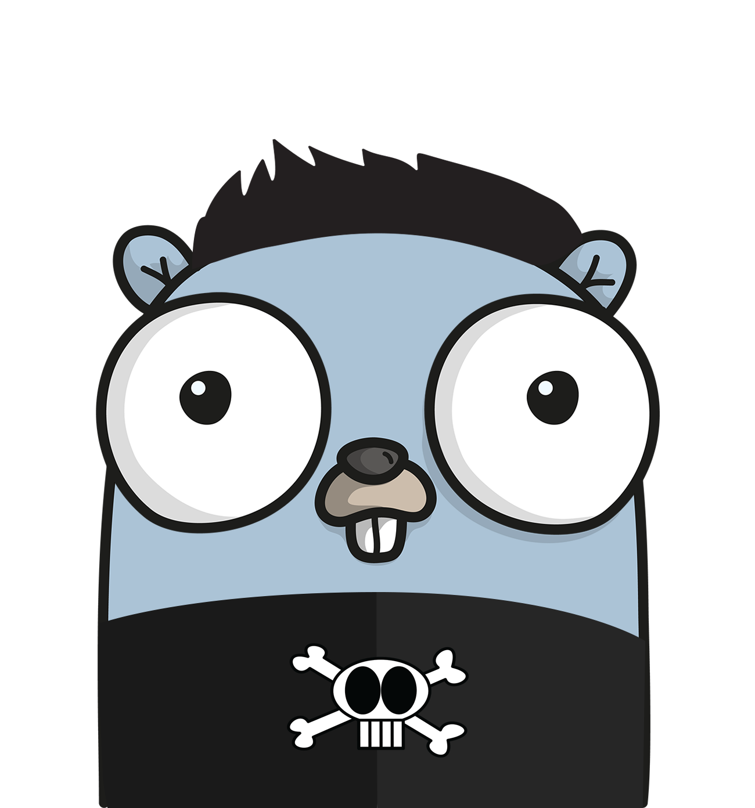

#  Golang bones




[](https://github.com/im-kulikov/go-bones/actions)
[](https://goreportcard.com/report/github.com/im-kulikov/go-bones)
[](https://github.com/im-kulikov/go-bones)

[](https://dependabot.com)

* [Makefile](#makefile)
* [Examples](#examples)
* [Config](#config)
    + [Base flags](#base-flags)
    + [Envs](#envs)
* [Logger](#logger)
* [Service runner (goroutine manager) component](#service-runner--goroutine-manager--component)
* [Web services](#web-services)
    + [OPS service](#ops-service)
    + [HTTP custom service](#http-custom-service)
    + [gRPC custom service](#grpc-custom-service)
* [Tracing component](#tracing-component)
    + [Preconfigured Jaeger](#preconfigured-jaeger)
    + [gRPC](#grpc)
        - [Examples for grpc.Conn](#examples-for-grpcconn)
        - [Examples for grpc.Server](#examples-for-grpcserver)
    + [HTTP](#http)
        - [Examples for http.Client](#examples-for-httpclient)
        - [Examples for http.Server](#examples-for-httpserver)

Production and kubernetes ready preconfigured library that contains several components for our projects
- configuration (based on env)
- logger (wrapped zap.SugaredLogger)
- service (runner manager for transport servers and workers)
- web (http / gRPC transport servers)
- tracer (jaeger)

## Makefile

| Command                    | Description                                                            |
|----------------------------|------------------------------------------------------------------------|
| help                       | Show this help                                                         |
| deps                       | Ensure dependencies                                                    |
| lint                       | Run Golang linters aggregator                                          |
| install-tools              | Install tools needed for development                                   |
| test                       | Run all tests (pass package as argument if you want test specific one) |


## Examples

*Notice* You don't need to use flags, all supported flags already exist in `config` component.
We propose to use environment variables instead of custom project flags, configuration files or something else.
```
Usage:

  -V, --version    show current version
  -h, --help       show this help message
      --markdown   generate env markdown table
      --validate   validate config
```

*Notice* If you need add description for your custom application config option, just add it to field struct description,
for example:

```go
package main

import "github.com/im-kulikov/go-bones/config"

type CustomAppSettings struct {
	config.Base // we propose to include base configuration

	// App specific settings
	MyParameter string `env:"MY_PARAMETER" usage:"custom description"`

	MyStructure struct {
		// -> MY_STRUCTURE_FIELD_ONE
		FieldOne int `env:"FIELD_ONE" default:"10"`
		// -> MY_STRUCTURE_FIELD_TWO
		FieldTwo string `env:"FIELD_TWO" default:"some default value"`
	}
}
```

*Notice:* You must include base configuration into app custom settings struct:

```go
package main

import "github.com/im-kulikov/go-bones/config"

type CustomAppSettings struct {
	config.Base

    // AppSpecificSettings...
}
```

so you can use them out of the box, simple example of `main.go`

```go
package main

import (
    "context"
    "os/signal"
    "syscall"

    "github.com/im-kulikov/go-bones/config"
    "github.com/im-kulikov/go-bones/logger"
    "github.com/im-kulikov/go-bones/service"
    "github.com/im-kulikov/go-bones/tracer"
    "github.com/im-kulikov/go-bones/web"
)

type settings struct {
    config.Base

    API web.HTTPConfig `env:"API"`

    ShouldHaveDefaultValue int `env:"MY_KEY" default:"100500"`
}

var (
	version = "dev"
    appName = "example"
)

func (c settings) Validate(ctx context.Context) error {
    // check that your fields is ok...

    return c.Base.Validate(ctx)
}

func main() {
    var cfg settings

    ctx, cancel := signal.NotifyContext(context.Background(), syscall.SIGHUP, syscall.SIGINT, syscall.SIGTERM)
    defer cancel()

    var err error
    if err = config.Load(ctx, cfg.Base); err != nil {
        logger.Default().Fatalf("could not prepare config: %s", err)
    }

    var log logger.Logger
    if log, err = logger.New(cfg.Base.Logger,
        logger.WithAppName(appName),
        logger.WithAppVersion(version)); err != nil {
        logger.Default().Fatalf("could not prepare logger: %s", err)
    }

    var trace service.Service
    if trace, err = tracer.Init(log, cfg.Base.Tracer); err != nil {
        log.Fatalf("could not initialize tracer: %s", err)
    }

    wrk, ops := web.NewOpsServer(log, cfg.Base.Ops)

    group := service.New(log,
        service.WithService(ops),
        service.WithService(wrk),
        service.WithService(trace),
        service.WithShutdownTimeout(cfg.Base.Shutdown))

    if err = group.Run(context.Background()); err != nil {
        log.Fatalf("something went wrong: %s", err)
    }
}
```

## Config

Contains default components configurations and base flags.

### Base flags

```
  -V, --version    show current version
  -h, --help       show this help message
      --markdown   generate env markdown table
      --validate   validate config
```

### Envs

| Name                        | Required | Default value | Usage                                          | Example                             |
|-----------------------------|----------|---------------|------------------------------------------------|-------------------------------------|
| SHUTDOWN_TIMEOUT            | false    | 5s            | allows to set custom graceful shutdown timeout |                                     |
| OPS_DISABLE                 | false    | false         | allows to disable ops server                   |                                     |
| OPS_ADDRESS                 | false    | :8081         | allows to set set ops address:port             |                                     |
| OPS_NETWORK                 | false    | tcp           | allows to set ops listen network: tcp/udp      |                                     |
| OPS_NO_TRACE                | false    | true          | allows to disable tracing                      |                                     |
| OPS_METRICS_PATH            | false    | /metrics      | allows to set custom metrics path              |                                     |
| OPS_HEALTHY_PATH            | false    | /healthy      | allows to set custom healthy path              |                                     |
| OPS_PROFILE_PATH            | false    | /debug/pprof  | allows to set custom profiler path             |                                     |
| LOGGER_ENCODING_CONSOLE     | false    | false         | allows to set user-friendly formatting         |                                     |
| LOGGER_LEVEL                | false    | info          | allows to set custom logger level              |                                     |
| LOGGER_TRACE                | false    | fatal         | allows to set custom trace level               |                                     |
| LOGGER_SAMPLE_RATE          | false    | 1000          | allows to set sample rate                      |                                     |
| SENTRY_DSN                  | false    |               | allows to set custom sentry DSN                | https://public@sentry.example.com/1 |
| SENTRY_ENVIRONMENT          | false    |               | allows to set custom sentry environment        | production                          |
| TRACER_TYPE                 | false    | jaeger        | allows to set trace exporter type              |                                     |
| TRACER_DISABLE              | false    | false         | allows to disable tracing                      |                                     |
| TRACER_SAMPLER              | false    | 1             | allows to choose sampler                       |                                     |
| TRACER_ENDPOINT             | false    |               | allows to set jaeger endpoint (one of)         | http://localhost:14268/api/traces   |
| TRACER_AGENT_HOST           | false    |               | allows to set jaeger agent host (one of)       | localhost                           |
| TRACER_AGENT_PORT           | false    |               | allows to set jaeger agent port                | 6831                                |
| TRACER_AGENT_RETRY_INTERVAL | false    | 15s           | allows to set retry connection timeout         |                                     |

    (one off) - you can provide TRACER_ENDPOINT or TRACER_AGENT_HOST
    1. TRACER_ENDPOINT - used for HTTP jaeger exporter
    2. TRACER_AGENT_HOST and TRACER_AGENT_PORT - used for UDP exporter

## Logger

Contains preconfigured `logger.Logger`

```go
package main

import (
    "github.com/im-kulikov/go-bones/logger"
)

var version string

func main() {
    sample := 1000

    loggerConfig := logger.Config{
        EncodingConsole: true,
        Level:           "info",
        Trace:           "fatal",
        SampleRate:      &sample,
    }

    log, err := logger.New(loggerConfig,
        logger.WithAppName("name"),
        logger.WithAppVersion(version))

    if err != nil {
        logger.Default().Fatalf("could not prepare logger: %s", err)
    }

    _ = log

    // ...
}
```

## Service runner (goroutine manager) component

It allows concentrate on business logic and just pass
services (Start/Stop/Name interface) into it.

```go
package main

import (
    "context"
    "errors"
    "os/signal"
    "time"

    "github.com/im-kulikov/go-bones/logger"
    "github.com/im-kulikov/go-bones/service"
)

type web struct{ service.Service }
type ops struct{ service.Service }
type run struct{ service.Service }

const shutdownTimeout = time.Second * 5

var errToIgnore = errors.New("should be ignored")

var (
    _ service.Service = (*web)(nil)
    _ service.Service = (*ops)(nil)
    _ service.Service = (*run)(nil)
)

func main() {
    runService := new(run)
    webService := new(web)
    opsService := new(ops)

    group := service.New(logger.Default(),
        service.WithService(runService),
        service.WithService(webService),
        service.WithService(opsService),
        service.WithIgnoreError(errToIgnore),
        service.WithShutdownTimeout(shutdownTimeout))

    ctx, cancel := signal.NotifyContext(context.Background())
    defer cancel()

    if err := group.Run(ctx); err != nil {
        panic(err)
    }
}
```

## Web services

Allows concentrate on business logic and use preconfigured http / gRPC services.

### OPS service

Contains next handlers (can be changed by configuration)
- /healthy
- /metrics
- /debug/pprof

```go
package main

import (
    "github.com/im-kulikov/go-bones/logger"
    "github.com/im-kulikov/go-bones/web"
    "go.uber.org/zap"
)

func main() {
    log := logger.Default()
    wrk, ops := web.NewOpsServer(log, web.OpsConfig{
        Disable: false,
        Address: ":8081",
        Network: "tcp",
        NoTrace: false,

        HealthyPath: "/custom-healthy-path",
        MetricsPath: "/custom-metrics-path",
        ProfilePath: "/custom-profile-path",
    }, ...web.HealthChecker)

    _ = ops // http.Server with healthy, metrics and profiler
    _ = wrk // HealthChecker's worker that run health check for each passed component

    // ...
}
```

### HTTP custom service

```go
package main

import (
    "net/http"

    "github.com/im-kulikov/go-bones/web"
)

func router() http.Handler { panic("implement me") }

func main() {
    handler := router()

    custom := web.NewHTTPServer(
        web.WithHTTPName("custom"),
        web.WithHTTPHandler(handler),
        web.WithHTTPConfig(web.HTTPConfig{
            Disable: false,
            Address: ":8080",
            Network: "tcp",
        }))

    _ = custom

    // ...
}
```


### gRPC custom service

```go
package main

import (
    "github.com/im-kulikov/go-bones/web"
)

type service struct {
    // implement me
    web.GRPCService
}

// implement me.
func newService() web.GRPCService {
    return new(service)
}

func main() {
    service1 := newService()
    service2 := newService()
    service3 := newService()

    custom := web.NewGRPCServer(
        web.WithGRPCName("custom"),
        web.WithGRPCService(service1),
        web.WithGRPCService(service2),
        web.WithGRPCService(service3),
        web.WithGRPCConfig(web.GRPCConfig{
            Disable: false,
            Address: ":9090",
            Network: "tcp",
        }))

    _ = custom

    // ...
}
```

## Tracing component

You can find more information about tracing conventions in public
[documentation](https://opentelemetry.io)

### Preconfigured Jaeger

```go
package main

import (
    "time"

    "github.com/im-kulikov/go-bones/logger"
    "github.com/im-kulikov/go-bones/service"
    "github.com/im-kulikov/go-bones/tracer"
)

func main() {
    var err error

    cfg := tracer.Config{
        Type:    tracer.JaegerType,
        Disable: false,

        Jaeger: tracer.Jaeger{
            Sampler:       1,
            Service:       "custom-service",
            Endpoint:      "http://jaeger-endpoint",
            AgentEndpoint: "jaeger-udp-endpoint:6831",
            RetryInterval: time.Second * 15,
        },
    }

    var trace service.Service
    if trace, err = tracer.Init(logger.Default(), cfg); err != nil { // ... tracer.Option)
        logger.Default().Fatalf("could not initialize tracing %v", err)
    }

    _ = trace
}
```

### gRPC

#### Examples for grpc.Conn

*Without context*

```go
package main

import (
    gprom "github.com/grpc-ecosystem/go-grpc-prometheus"
    "go.opentelemetry.io/contrib/instrumentation/google.golang.org/grpc/otelgrpc"
    "google.golang.org/grpc"
    "google.golang.org/grpc/credentials/insecure"

    "github.com/im-kulikov/go-bones/tracer"
)

func main() {
    conn, err := grpc.Dial("localhost:8080",
        // prometheus and tracing enabling:
        grpc.WithChainUnaryInterceptor(gprom.UnaryClientInterceptor, otelgrpc.UnaryClientInterceptor()),
        grpc.WithChainStreamInterceptor(gprom.StreamClientInterceptor, otelgrpc.StreamClientInterceptor()),

        // example of custom client dial options
        grpc.WithBlock(),
        grpc.WithTransportCredentials(insecure.NewCredentials()))
    if err != nil {

    }
    defer conn.Close()

    // do something with gRPC connection...
}
```

*With context*

```go
package main

import (
    "context"

    gprom "github.com/grpc-ecosystem/go-grpc-prometheus"
    "go.opentelemetry.io/contrib/instrumentation/google.golang.org/grpc/otelgrpc"
    "google.golang.org/grpc"
    "google.golang.org/grpc/credentials/insecure"

    "github.com/im-kulikov/go-bones/tracer"
)

func main() {
    ctx, cancel := context.WithCancel(context.TODO())
    defer cancel()

    conn, err := grpc.DialContext(ctx, "localhost:8080",
        // prometheus and tracing enabling:
        grpc.WithChainUnaryInterceptor(gprom.UnaryClientInterceptor, otelgrpc.UnaryClientInterceptor()),
        grpc.WithChainStreamInterceptor(gprom.StreamClientInterceptor, otelgrpc.StreamClientInterceptor()),

        // example of custom client dial options
        grpc.WithBlock(),
        grpc.WithTransportCredentials(insecure.NewCredentials()))
    if err != nil {

    }
    defer conn.Close()

    // do something with gRPC connection...
}
```

#### Examples for grpc.Server

```go
package main

import (
    "context"
    "net"
    "time"

    gprom "github.com/grpc-ecosystem/go-grpc-prometheus"
    "go.opentelemetry.io/contrib/instrumentation/google.golang.org/grpc/otelgrpc"
    "google.golang.org/grpc"
    "google.golang.org/grpc/keepalive"

    "github.com/im-kulikov/go-bones/tracer"
)

func main() {
    srv := grpc.NewServer(
        // prometheus and tracing enabling:
        grpc.ChainUnaryInterceptor(gprom.UnaryServerInterceptor, otelgrpc.UnaryServerInterceptor()),
        grpc.ChainStreamInterceptor(gprom.StreamServerInterceptor, otelgrpc.StreamServerInterceptor()),

        // for example of custom server options
        grpc.KeepaliveParams(keepalive.ServerParameters{
            Timeout: time.Second * 30,
        }))

    ctx, cancel := context.WithCancel(context.TODO())
    defer cancel()

    lis, err := new(net.ListenConfig).Listen(ctx, "tcp", ":8080")
    if err != nil {
        panic(err)
    }

    if err = srv.Serve(lis); err != nil {
        panic(err)
    }
}
```

### HTTP

#### Examples for http.Client

```go
package main

import (
    "context"
    "net/http"

    "github.com/im-kulikov/go-bones/tracer"
    "github.com/im-kulikov/go-bones/web"
)

func main() {
    cli := http.DefaultClient
    web.ApplyTracingToHTTPClient(cli)

    ctx, cancel := context.WithCancel(context.TODO())
    defer cancel()

    req, err := http.NewRequestWithContext(ctx, http.MethodGet, "https://google.com", nil)
    if err != nil {
        panic(err)
    }

    if _, err = cli.Do(req); err != nil {
        panic(err)
    }
}
```

#### Examples for http.Server

```go
package main

import (
    "net/http"
    "net/http/pprof"

    "github.com/im-kulikov/go-bones/web"
)

func main() {
    mux := http.NewServeMux()
    // with http.Handler
    mux.Handle("/heap", web.HTTPTracingMiddleware(pprof.Handler("heap")))

    // with http.HandlerFunc
    mux.Handle("/test", web.HTTPTracingMiddlewareFunc(func(w http.ResponseWriter, r *http.Request) {
        w.WriteHeader(http.StatusOK)
    }))

    if err := http.ListenAndServe(":8080", mux); err != nil {
        panic(err)
    }
}
```
