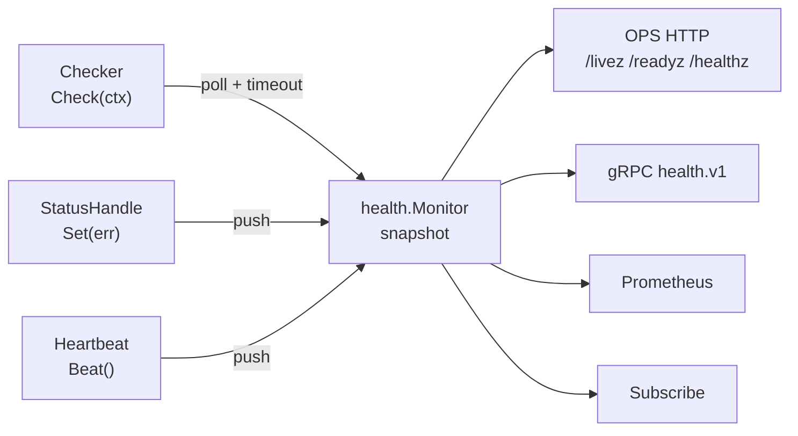
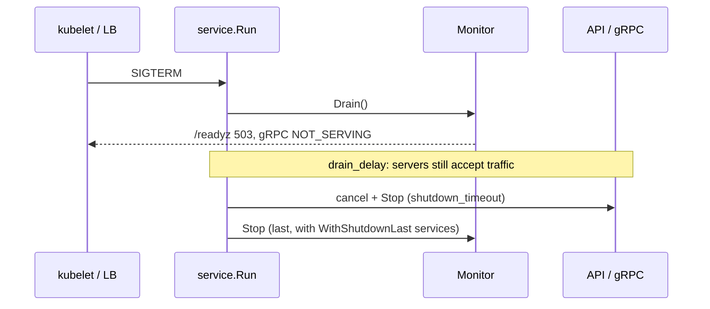

[](https://github.com/im-kulikov/go-bones/actions/workflows/go.yml)
[](https://goreportcard.com/report/github.com/im-kulikov/go-bones)

[](https://pkg.go.dev/mod/github.com/im-kulikov/go-bones)
[](https://github.com/im-kulikov/go-bones)

[](https://dependabot.com)

`go-bones` is a small application foundation for Go services. It provides:

- configuration loading via `config`
- structured logging via `logger`
- lifecycle orchestration via `service`
- HTTP, gRPC, and OPS transports via `network/http` and `network/grpc`
- OpenTelemetry bootstrap via `tracer`

The library is intentionally opinionated:

- use one config struct with embedded `config.Base`
- initialize logging once at startup
- run long-lived components through `service.Run`
- expose operational endpoints through the OPS server
- report readiness and liveness through one non-blocking health monitor
- prefer standard `OTEL_*` environment variables for telemetry configuration

## Contents

- [Installation](#installation)
- [Quick Start](#quick-start)
- [Configuration Model](#configuration-model)
- [Logger](#logger)
- [Lifecycle Runner](#lifecycle-runner)
- [HTTP Service](#http-service)
- [gRPC Service](#grpc-service)
- [OPS Service](#ops-service)
- [Health Checks](#health-checks)
- [OpenTelemetry](#opentelemetry)
- [Make Targets](#make-targets)

## Installation

```bash
go get github.com/im-kulikov/go-bones
```

## Quick Start

This is the intended shape of an application built on top of `go-bones`.

```go
package main

import (
	"context"
	"errors"
	"os"
	"time"

	"github.com/im-kulikov/go-bones/config"
	"github.com/im-kulikov/go-bones/health"
	"github.com/im-kulikov/go-bones/logger"
	"github.com/im-kulikov/go-bones/network/grpc"
	"github.com/im-kulikov/go-bones/network/http"
	"github.com/im-kulikov/go-bones/service"
	"github.com/im-kulikov/go-bones/tracer"
)

type appConfig struct {
	config.Base `env:",squash" yaml:",inline" json:",inline" toml:",inline"`

	HTTP httpConfig `env:"HTTP" yaml:"http" json:"http" toml:"http"`
	GRPC grpcConfig `env:"GRPC" yaml:"grpc" json:"grpc" toml:"grpc"`
	App  runtimeConfig `env:"APP" yaml:"app" json:"app" toml:"app"`
}

type runtimeConfig struct {
	ShutdownTimeout time.Duration `env:"SHUTDOWN_TIMEOUT" yaml:"shutdown_timeout" default:"20s"`
}

type httpConfig struct {
	config.Network `env:",squash" yaml:",inline" json:",inline" toml:",inline"`
	Address        string `env:"ADDRESS" yaml:"address" json:"address" toml:"address" default:":8080"`
}

func (c httpConfig) Addr() string { return c.Address }

type grpcConfig struct {
	config.Network `env:",squash" yaml:",inline" json:",inline" toml:",inline"`
	Address        string `env:"ADDRESS" yaml:"address" json:"address" toml:"address" default:":9090"`
}

func (c grpcConfig) Addr() string { return c.Address }

func main() {
	var cfg appConfig
	if err := config.Load(&cfg,
		config.WithName("my-service"),
		config.WithVersion("dev"),
	); err != nil {
		_, _ = os.Stderr.WriteString(err.Error() + "\n")
		os.Exit(1)
	}

	log := logger.Init(cfg.Logger)
	telemetry := tracer.Init(log, cfg.Tracer)
	hc := health.New(cfg.Health, log)

	httpSvc, err := newHTTPService(cfg, log)
	if err != nil {
		log.Error("build http service", logger.Err(err))
		os.Exit(1)
	}

	grpcSvc, err := newGRPCService(cfg, log, hc)
	if err != nil {
		log.Error("build grpc service", logger.Err(err))
		os.Exit(1)
	}

	opsSvc, err := http.NewOPSServer(cfg.OpsServer, log, http.WithHealth(hc))
	if err != nil {
		log.Error("build ops service", logger.Err(err))
		os.Exit(1)
	}

	group := service.Compose(telemetry, opsSvc, httpSvc, grpcSvc)
	if err = service.Run(log,
		service.WithHealth(hc), // services implementing Check(ctx) error become readiness checks
		service.WithDrainDelay(cfg.Health.DrainDelay),
		service.WithShutdownTimeout(cfg.App.ShutdownTimeout),
		service.WithService(group),
	); err != nil && !errors.Is(err, context.Canceled) {
		log.Error("application stopped with error", logger.Err(err))
		os.Exit(1)
	}
}

func newHTTPService(cfg appConfig, log *logger.Logger) (service.Service, error) {
	mux := http.NewServeMux()
	mux.HandleFunc("/", func(w http.ResponseWriter, _ *http.Request) {
		_, _ = w.Write([]byte("ok"))
	})

	return http.NewServer(
		cfg.HTTP,
		log,
		http.ServiceName("api"),
		http.WithOpenTelemetry(),
		http.ServerOptions(func(srv *http.Server) {
			srv.Handler = mux
		}),
	)
}

func newGRPCService(cfg appConfig, log *logger.Logger, hc *health.Monitor) (service.Service, error) {
	return grpc.NewServer(
		cfg.GRPC,
		log,
		grpc.ServiceName("rpc"),
		grpc.WithOpenTelemetry(),
		grpc.WithHealth(hc), // grpc.health.v1 follows the monitor
	)
}
```

## Configuration Model

`config.Load` is the entrypoint for application configuration.

Under the hood, `go-bones/config` uses [`gonfig`](https://github.com/im-kulikov/gonfig) as the loader engine.  
`go-bones` adds:

- the shared `config.Base` model
- app name/version propagation into supported config sections
- repository-friendly defaults such as YAML are enabled by default
- a stable place for built-in logger, ops, and tracer config

```go
var cfg appConfig
err := config.Load(&cfg,
	config.WithName("my-service"),
	config.WithVersion("1.2.3"),
)
```

Key points:

- `config.Base` already includes `Logger`, `OpsServer`, and `Tracer`
- YAML loading is enabled by default
- app name and version are propagated into config sections that support them
- `gonfig` still does the heavy lifting for env/YAML/JSON/TOML parsing
- transport packages expect config types implementing `config.INetwork`

Typical custom config shape:

```go
type appConfig struct {
	config.Base `env:",squash" yaml:",inline" json:",inline" toml:",inline"`

	HTTP httpConfig `env:"HTTP" yaml:"http" json:"http" toml:"http"`

	App struct {
		WorkerInterval time.Duration `env:"WORKER_INTERVAL" yaml:"worker_interval" default:"15s"`
	} `env:"APP" yaml:"app" json:"app" toml:"app"`
}

type httpConfig struct {
	config.Network `env:",squash" yaml:",inline" json:",inline" toml:",inline"`
	Address        string `env:"ADDRESS" yaml:"address" default:":8080"`
}

func (c httpConfig) Addr() string { return c.Address }
```

Representative YAML:

```yaml
logger:
  level: info
  format: text
  add_source: true
  add_app_info: true
  open_tracing: true
  secrets:
    - authorization
    - api_key

ops:
  address: ":8090"
  enabled: true
  metrics_enabled: true
  profile_enabled: false
  exp_vars_enabled: false
  version_enabled: true

tracer:
  enabled: true
  send_logs: true
  send_metrics: true
  use_http: true
  endpoint: "otel-collector:4318"
  insecure: true

http:
  address: ":8080"
  shutdown_timeout: 10s

grpc:
  address: ":9090"
  shutdown_timeout: 10s
```

### Loading configuration from a file

`config.Load` can load configuration from a file through `gonfig` file loaders.

To enable this, you need two things:

1. Enable the parser you want:
   - `config.WithYAML()`
   - `config.WithJSON()`
   - `config.WithTOML()`
2. Add a root config field marked as a config-path flag:

```go
type appConfig struct {
	config.Base `env:",squash" yaml:",inline"`

	Config string `flag:"config,config:true"`

	HTTP httpConfig `env:"HTTP" yaml:"http"`
}
```

If you prefer the default config-path flags, you can embed `config.DefaultConfigFlag`
instead of declaring the `Config` field manually. It enables the standard `--config`
and `-c` flags for your config struct.

```go
type appConfig struct {
	config.Base `env:",squash" yaml:",inline"`
	config.DefaultConfigFlag `env:",squash" yaml:",inline" json:",inline" toml:",inline"`

	HTTP httpConfig `env:"HTTP" yaml:"http"`
}
```

Then you can start the service with:

```bash
./my-service --config ./config.yaml
```

Example:

```go
var cfg appConfig
err := config.Load(&cfg,
	config.WithName("my-service"),
	config.WithVersion("dev"),
	config.WithYAML(),
)
```

Notes:

- if you do not specify a parser option, `config.Load` enables YAML by default
- the `--config` flag is provided by `gonfig` through the `flag:"config,config:true"` tag
- file loading is optional; the same config can still be fully driven by environment variables and flags

### Configuration load order

The effective load order follows `gonfig` semantics:

1. defaults from struct tags
2. config-path pre-scan from flags, for example `--config ./config.yaml`
3. file loader (`YAML`, `JSON`, or `TOML`)
4. environment variables
5. command-line flags

In practice this means:

- file values override defaults
- env variables override file values
- flags have the highest priority

This is usually the desired production behavior:

- keep a baseline in a file
- override sensitive or environment-specific values through env
- use flags only for explicit local overrides or bootstrapping

### Environment variables by module

Built-in config blocks from `config.Base` are exposed through these prefixes:

- `LOGGER_*`
- `OPS_*`
- `OTEL_*`
- `HEALTH_*`

Your own application blocks keep the same pattern. For example, if your config has:

```go
type appConfig struct {
	config.Base `env:",squash" yaml:",inline"`

	HTTP httpConfig `env:"HTTP" yaml:"http"`
	GRPC grpcConfig `env:"GRPC" yaml:"grpc"`
	App  runtimeConfig `env:"APP" yaml:"app"`
}
```

then the derived env names look like:

- `HTTP_ADDRESS`
- `HTTP_SHUTDOWN_TIMEOUT`
- `HTTP_TLS_ENABLED`
- `GRPC_ADDRESS`
- `GRPC_SHUTDOWN_TIMEOUT`
- `GRPC_TLS_ENABLED`
- `APP_SHUTDOWN_TIMEOUT`

#### `LOGGER_*`

| Env                           | Default | Meaning                                                                              |
|-------------------------------|---------|--------------------------------------------------------------------------------------|
| `LOGGER_OPEN_TRACING_ENABLED` | `false` | Enables bridging logger records into the process-wide OpenTelemetry logger provider. |
| `LOGGER_SECRETS`              | empty   | Comma-separated field names to redact in logs.                                       |
| `LOGGER_LEVEL`                | `info`  | Log level for the default logger.                                                    |
| `LOGGER_FORMAT`               | `text`  | Output format: `text` or `json`.                                                     |
| `LOGGER_ADD_SOURCE`           | `false` | Includes source file and line information.                                           |
| `LOGGER_ADD_APP_INFO`         | `false` | Includes app metadata such as name and version in log output.                        |

#### `OPS_*`

| Env                       | Default          | Meaning                                                               |
|---------------------------|------------------|-----------------------------------------------------------------------|
| `OPS_ADDRESS`             | `:8090`          | Listen address for the OPS server.                                    |
| `OPS_ENABLED`             | `true`           | Enables the OPS server when at least one endpoint is enabled.         |
| `OPS_METRICS_PATH`        | `/metrics`       | Prometheus metrics endpoint path.                                     |
| `OPS_METRICS_ENABLED`     | `true`           | Enables the Prometheus metrics endpoint and runtime collector.        |
| `OPS_PROFILE_PATH`        | `/debug/pprof`   | Base path for `pprof` handlers.                                       |
| `OPS_PROFILE_ENABLED`     | `true`           | Enables `pprof` debugging endpoints.                                  |
| `OPS_EXP_VARS_PATH`       | `/debug/vars`    | `expvar` endpoint path.                                               |
| `OPS_EXP_VARS_ENABLED`    | `true`           | Enables the `expvar` endpoint.                                        |
| `OPS_VERSION_PATH`        | `/version`       | Version endpoint path.                                                |
| `OPS_VERSION_ENABLED`     | `false`          | Enables the version endpoint.                                         |
| `OPS_HEALTH_ENABLED`      | `true`           | Enables `/livez`, `/readyz` and `/healthz` (see [Health Checks](#health-checks)). |
| `OPS_LIVE_PATH`           | `/livez`         | Liveness probe path.                                                  |
| `OPS_READY_PATH`          | `/readyz`        | Readiness (and startup) probe path.                                   |
| `OPS_HEALTH_PATH`         | `/healthz`       | Full JSON health report path.                                         |
| `OPS_READ_TIMEOUT`        | `0`              | HTTP read timeout for the OPS server.                                 |
| `OPS_WRITE_TIMEOUT`       | `0`              | HTTP write timeout for the OPS server.                                |
| `OPS_READ_HEADER_TIMEOUT` | `0`              | HTTP read-header timeout for the OPS server.                          |
| `OPS_IDLE_TIMEOUT`        | `0`              | HTTP idle timeout for the OPS server.                                 |
| `OPS_SHUTDOWN_TIMEOUT`    | `30s`            | Graceful shutdown timeout.                                            |
| `OPS_MAX_HEADER_BYTES`    | `0`              | Max request header size.                                              |
| `OPS_TLS_ENABLED`         | `false`          | Enables TLS for the OPS server.                                       |
| `OPS_TLS_CERT_FILE`       | empty            | TLS certificate path.                                                 |
| `OPS_TLS_KEY_FILE`        | empty            | TLS private key path.                                                 |
| `OPS_TLS_CLIENT_AUTH`     | `no-client-cert` | TLS client auth mode.                                                 |
| `OPS_TLS_CA_CERT_FILE`    | empty            | CA certificate path for client verification.                          |
| `OPS_TLS_MIN_VERSION`     | `TLS13`          | Minimum TLS version.                                                  |
| `OPS_TLS_CIPHER_SUITES`   | empty            | Cipher suites for TLS 1.0–1.2; rejected at startup if set together with `OPS_TLS_MIN_VERSION=TLS13`, since Go's TLS 1.3 stack ignores this setting. |

#### `HEALTH_*`

Defaults of the health monitor (`config.Health`). They are starting points, not an SLA: override them per dependency with `health.WithInterval`, `health.WithTimeout`, `health.WithThresholds`.

| Env                          | Default | Meaning                                                                                  |
|------------------------------|---------|------------------------------------------------------------------------------------------|
| `HEALTH_INTERVAL`            | `10s`   | Polling period once a check has passed.                                                  |
| `HEALTH_INITIAL_INTERVAL`    | `1s`    | Polling period until the first success (services start in parallel, first checks often fail). |
| `HEALTH_TIMEOUT`             | `2s`    | Deadline of one `Check` call (a cold TLS handshake often takes more than 1s).            |
| `HEALTH_MIN_INTERVAL`        | `1s`    | Minimal distance between runs requested by `Trigger`.                                    |
| `HEALTH_STALE_AFTER`         | `0`     | A result older than this is stale; `0` means `2*interval + timeout`.                     |
| `HEALTH_FAILURE_THRESHOLD`   | `1`     | Consecutive failures that turn a passing check into failing.                             |
| `HEALTH_SUCCESS_THRESHOLD`   | `1`     | Consecutive successes that turn a failing check into passing.                            |
| `HEALTH_DRAIN_DELAY`         | `0`     | Pause between withdrawing readiness and stopping services on SIGTERM (`5s` in Kubernetes). |
| `HEALTH_LOG_REPEAT_INTERVAL` | `5m`    | How often a still failing check is reminded in logs.                                     |

#### `OTEL_*` from `config.TracerConfig`

These are repository-level fallback variables. Standard OpenTelemetry exporter variables still have priority.

| Env                 | Default          | Meaning                                                            |
|---------------------|------------------|--------------------------------------------------------------------|
| `OTEL_ENABLED`      | `false`          | Enables repository OpenTelemetry bootstrap.                        |
| `OTEL_SEND_LOGS`    | `false`          | Enables OTel log export path.                                      |
| `OTEL_SEND_METRICS` | `false`          | Enables OTel metrics export path.                                  |
| `OTEL_ENDPOINT`     | `localhost:4317` | Fallback OTLP endpoint when exporter-specific env is absent.       |
| `OTEL_INSECURE`     | `true`           | Fallback insecure OTLP transport setting.                          |
| `OTEL_USE_HTTP`     | `false`          | Fallback switch to OTLP HTTP when exporter protocol env is absent. |

#### Standard `OTEL_*` variables

These are the preferred runtime contracts for real deployments:

| Env                                   | Meaning                                                                                          |
|---------------------------------------|--------------------------------------------------------------------------------------------------|
| `OTEL_SERVICE_NAME`                   | Explicit service name in OTel resource attributes.                                               |
| `OTEL_RESOURCE_ATTRIBUTES`            | Additional resource attributes, for example `deployment.environment=prod,service.version=1.2.3`. |
| `OTEL_PROPAGATORS`                    | Propagator list, for example `tracecontext,baggage`.                                             |
| `OTEL_EXPORTER_OTLP_ENDPOINT`         | Common OTLP endpoint for all enabled signals.                                                    |
| `OTEL_EXPORTER_OTLP_INSECURE`         | Common insecure flag for OTLP exporters.                                                         |
| `OTEL_EXPORTER_OTLP_PROTOCOL`         | Common OTLP protocol, for example `grpc` or `http/protobuf`.                                     |
| `OTEL_EXPORTER_OTLP_TRACES_ENDPOINT`  | Trace-specific OTLP endpoint.                                                                    |
| `OTEL_EXPORTER_OTLP_TRACES_INSECURE`  | Trace-specific insecure flag.                                                                    |
| `OTEL_EXPORTER_OTLP_TRACES_PROTOCOL`  | Trace-specific protocol.                                                                         |
| `OTEL_EXPORTER_OTLP_METRICS_ENDPOINT` | Metrics-specific OTLP endpoint.                                                                  |
| `OTEL_EXPORTER_OTLP_METRICS_INSECURE` | Metrics-specific insecure flag.                                                                  |
| `OTEL_EXPORTER_OTLP_METRICS_PROTOCOL` | Metrics-specific protocol.                                                                       |
| `OTEL_EXPORTER_OTLP_LOGS_ENDPOINT`    | Logs-specific OTLP endpoint.                                                                     |
| `OTEL_EXPORTER_OTLP_LOGS_INSECURE`    | Logs-specific insecure flag.                                                                     |
| `OTEL_EXPORTER_OTLP_LOGS_PROTOCOL`    | Logs-specific protocol.                                                                          |

## Logger

The logger package wraps `log/slog` and exposes both explicit logger instances and a process-wide default logger.

Typical startup:

```go
log := logger.Init(cfg.Logger)
```

What `logger.Init` gives you:

- log level and format from `config.Logger`
- optional source locations
- optional app metadata fields
- secret masking
- optional OpenTelemetry log bridge when `logger.open_tracing` is enabled and `tracer.Init(...)` installs a logger provider

Package-level helpers are available:

```go
logger.Info("service started")
logger.Error("request failed", logger.Err(err))
```

For request-scoped fields, attach attributes to context:

```go
ctx = logger.AddContextAttrs(ctx,
	logger.String("request_id", requestID),
	logger.String("tenant", tenantID),
)

log.InfoContext(ctx, "handled request")
```

## Lifecycle Runner

`service.Run` is the main orchestration primitive for long-lived components.

Use it for:

- HTTP servers
- gRPC servers
- telemetry bootstrap
- background workers

Example:

```go
worker := service.NewLauncher("worker", func(ctx context.Context) error {
	<-ctx.Done()
	return context.Cause(ctx)
})

err := service.Run(log,
	service.WithShutdownTimeout(20*time.Second),
	service.WithService(worker, telemetry, opsSvc, httpSvc, grpcSvc),
)
```

Useful pieces:

- `service.NewLauncher(...)` for wrapping a start function into a managed service
- `service.Compose(...)` for grouping services without making the group itself independently runnable
- `service.WithIgnoreError(...)` for expected shutdown errors
- `service.WithHealth(...)`, `service.WithDrainDelay(...)` and `service.WithShutdownLast(...)` for health checks and graceful draining, see [Health Checks](#health-checks)

## HTTP Service

`network/http` owns the lifecycle of a standard `http.Server` and re-exports the most common stdlib HTTP types so application code usually does not need a second `net/http` import alias.

Typical wiring:

```go
handler := http.NewServeMux()
handler.HandleFunc("/ready", func(w http.ResponseWriter, _ *http.Request) {
	_, _ = w.Write([]byte("ok"))
})

svc, err := http.NewServer(
	cfg.HTTP,
	log,
	http.ServiceName("api"),
	http.WithOpenTelemetry(),
	http.ServerOptions(func(srv *http.Server) {
		srv.Handler = handler
	}),
)
```

Important behavior:

- the package opens the listener once and serves on it directly
- TLS is derived from `config.Network.TLSConfig`
- graceful shutdown uses `config.Network.ShutdownTimeout` with a safe fallback
- `WithOpenTelemetry()` extracts incoming trace context and creates server spans

## gRPC Service

`network/grpc` owns the lifecycle of a `grpc.Server` and re-exports the most common gRPC server-side types used for registration and descriptors.

Typical wiring:

```go
svc, err := grpc.NewServer(
	cfg.GRPC,
	log,
	grpc.ServiceName("rpc"),
	grpc.WithOpenTelemetry(),
	grpc.WithHealth(hc), // grpc.health.v1 backed by the health monitor
	grpc.RegisterServices(func(server *grpc.Server) {
		ordersv1.RegisterOrdersServer(server, orders)
	}),
)
```

Important behavior:

- TLS is derived from `config.Network.TLSConfig`
- graceful shutdown uses `config.Network.ShutdownTimeout` with a safe fallback
- `service.NewLauncher` makes the server lifecycle one-shot and terminal after shutdown starts
- `WithOpenTelemetry()` installs server-side unary and stream interceptors for trace extraction and span continuation
- `WithHealth(reader)` registers `grpc.health.v1`; see [gRPC health](#grpc-health)

## OPS Service

The OPS server is a ready-to-run HTTP service for diagnostics and runtime observability.

Keep the OPS port private to the pod or trusted internal network. `pprof` and `expvar`
can expose runtime and process details, so do not publish this server through a public
Service, ingress, or load balancer. Set `profile_enabled: false` and
`exp_vars_enabled: false` when those diagnostics are not needed.

```go
opsSvc, err := http.NewOPSServer(cfg.OpsServer, log)
```

By default, it exposes:

- `/metrics`
- `/debug/pprof`
- `/debug/vars`
- `/version` when `version_enabled=true`
- `/livez`, `/readyz`, `/healthz` when `health_enabled=true` (default), see [Health Checks](#health-checks)

Each endpoint family can be disabled independently with `metrics_enabled`,
`profile_enabled`, and `exp_vars_enabled`. Set `enabled: false` to disable the OPS
service entirely.

These switches default to `true` only when the config is loaded through `gonfig`
(`config.Load`, `gonfig.SetDefaults`). A `config.Ops` built as a struct literal has
them all `false`, and `http.NewOPSServer` then returns a `nil` service. Set them
explicitly or apply the defaults first:

```go
var ops config.Ops
if err := gonfig.SetDefaults(&ops); err != nil {
	return err
}
ops.Address = ":9090"
```

It also exposes named pprof profiles under the same base path, for example:

- `/debug/pprof/goroutine`
- `/debug/pprof/heap`
- `/debug/pprof/block`

When the process is built with `GOEXPERIMENT=goroutineleakprofile`, Go 1.26 also exposes:

- `/debug/pprof/goroutineleak`

Runtime metrics are exported through the standard Prometheus Go collector with `collectors.MetricsAll`, so scheduler, goroutine, GC, memory, and other Go 1.26 runtime metric groups are available.

Applications can register additional Prometheus collectors in the OPS metrics registry before starting the server:

```go
requestsTotal := prometheus.NewCounter(prometheus.CounterOpts{
	Name: "my_service_requests_total",
	Help: "Total handled requests.",
})

if err := http.RegisterMetrics(requestsTotal); err != nil {
	log.Error("register ops metrics", logger.Err(err))
}

opsSvc, err := http.NewOPSServer(cfg.OpsServer, log)
```

The OPS metrics registry is process-wide. Duplicate collector registration is returned as an error, so shared packages should register metrics once during startup.

`OPS` metrics and OpenTelemetry metrics are intentionally separate telemetry paths. Applications may use either one or both.

## Health Checks

Package `health` gives every service one non-blocking health model. A single
`health.Monitor` runs the checks in its own goroutines and keeps the last result
in an immutable snapshot. HTTP probes, gRPC health, Prometheus metrics and
subscribers only read that snapshot, so `/readyz` answers in microseconds even
when a dependency hangs.


```mermaid
flowchart LR
  C["Checker<br/>Check(ctx)"] -->|poll + timeout| M[health.Monitor<br/>snapshot]
  P["StatusHandle<br/>Set(err)"] -->|push| M
  H["Heartbeat<br/>Beat()"] -->|push| M
  M --> O["OPS HTTP<br/>/livez /readyz /healthz"]
  M --> G[gRPC health.v1]
  M --> PR[Prometheus]
  M --> S["Subscribe"]
```

### Wiring

```go
hc := health.New(cfg.Health, log)

// push status from a driver callback
kafka, _ := hc.Status("kafka", health.WithImpact(health.Informational))
consumer.OnStateChange(func(err error) { kafka.Set(err) })

ops, _ := http.NewOPSServer(cfg.OpsServer, log, http.WithHealth(hc))
rpc, _ := grpc.NewServer(cfg.GRPC, log, grpc.WithHealth(hc))

err := service.Run(log,
	service.WithHealth(hc),                        // db implements Check -> readiness check "db"
	service.WithDrainDelay(cfg.Health.DrainDelay), // SIGTERM: readiness off, wait, then stop
	service.WithShutdownLast(ops),                 // keep answering /readyz 503 until the end
	service.WithService(db, api, rpc, ops),
)
```

`service.WithHealth` starts the monitor with the other services and registers
every service (also inside `service.Compose`, disabled services are skipped)
that implements `service.HealthChecker` (`Check(ctx) error`) under its `Name()`
with `Impact=Readiness`. Implement `health.Configurer` to change the defaults:

```go
func (s *Cache) HealthOptions() []health.Option {
	return []health.Option{health.WithImpact(health.Informational)}
}
```

Launchers get a check with `service.WithLauncherHealthCheck(fn)`. Other things
are registered manually before `Run`: `hc.Register(name, checker, opts...)`.
A duplicate name or an invalid registration makes `Run` fail before any service
is started.

### Impact

| Impact                | A failure means                          | Use for                                            |
|-----------------------|------------------------------------------|----------------------------------------------------|
| `Readiness` (default) | `/readyz` 503, instance leaves balancing | dependencies without which requests cannot be served |
| `Informational`       | `/healthz` reports `degraded` (still 200) | optional dependencies, caches, async pipelines      |
| `Liveness`            | `/livez` 503, the pod is restarted       | internal state only: stuck loops, deadlocks (see `Heartbeat`) |

Never put external dependencies into liveness: a database outage would restart
every replica. Also keep in mind that with the default `Readiness` a shared
dependency (for example, the database) going down removes **all** replicas from
balancing at once. That is usually right (they cannot serve anyway, and clients
get a fast 503 from the load balancer instead of timeouts), but use
`Informational` for dependencies the service can live without.

### Writing checks

`Check` must respect `ctx`, must not leave goroutines behind, must be cheap and
must not check other services transitively. The deadline set by the monitor is
only a safety net: configure timeouts in the dependency client.

```go
// polled: pgx pool
hc.Register("postgres", health.CheckerFunc(func(ctx context.Context) error {
	if err := pool.Ping(ctx); err != nil {
		return health.PublicError("database unavailable", err) // safe text for HTTP
	}
	return nil
}), health.WithThresholds(2, 1))

// push: Kafka client reports its state, no polling at all
brokers, _ := hc.Status("kafka", health.WithImpact(health.Informational))
client.OnConnect(func() { brokers.Set(nil) })
client.OnDisconnect(func(err error) { brokers.Set(err) })

// re-check right away after a reconnect instead of waiting for the next tick
db.OnReconnect(func() { hc.Trigger("postgres") })

// heartbeat: liveness of a worker loop
hb, _ := hc.Heartbeat("consumer-loop", 30*time.Second)
tick := time.NewTicker(10 * time.Second) // wake up even when there is no work
for {
	hb.Beat()
	select {
	case <-ctx.Done():
		return nil
	case msg := <-messages:
		handle(msg)
	case <-tick.C:
	}
}
```

Behavior of the monitor:

- the first run happens right after `Start`, then every `initial_interval` until the first success, then every `interval` (±10% jitter);
- a run that exceeds `timeout` is recorded as `timeout` immediately; at most one call per check is in flight, ticks during a hung call are skipped;
- errors, timeouts and panics are failures; `failure_threshold`/`success_threshold` protect from flapping;
- a result older than `stale_after` (or `WithTTL` for push statuses) is `stale` and counts as failing;
- `hc.Trigger(name)` runs a check out of schedule (for example, from a reconnect callback); repeated calls are coalesced and limited by `min_interval`;
- `hc.Subscribe(func(health.Event))` notifies about transitions; always re-read `hc.Snapshot()` in the callback, a slow subscriber may lose old events.

### HTTP endpoints

Semantics follow the Kubernetes API server (`/livez`, `/readyz`, `?verbose`, `?exclude`).

| Endpoint                           | Purpose                        | 200                    | 503                                   |
|------------------------------------|--------------------------------|------------------------|---------------------------------------|
| `GET /livez`                       | `livenessProbe`                | live                   | a liveness check fails, monitor stopped |
| `GET /readyz`                      | `readinessProbe`, `startupProbe` | all readiness checks pass | a check is unknown/failing/stale, draining |
| `GET /healthz`                     | dashboards, on-call            | `ok`, `degraded`       | `failing`                             |
| `GET /livez/<check>`, `/readyz/<check>` | manual diagnostics        | the check passes       | otherwise (404 for unknown names)     |

```text
$ curl -s localhost:8090/readyz?verbose
[+]postgres ok
[-]redis failed: timeout
readyz check failed
```

- `?exclude=<name>` (repeatable) ignores a check in the aggregate for an emergency bypass; it never overrides draining;
- `?format=json` for `/livez` and `/readyz`; `/healthz` is always JSON;
- only `GET` and `HEAD` are allowed, responses carry `Cache-Control: no-store`;
- error texts are never exposed: responses contain a classification (`timeout`, `panic`, `stale`, `canceled`, `error`) or the message of `health.PublicError`. Full errors go to logs, where `logger` secrets masking applies.

Without `http.WithHealth` the OPS server still answers `/livez` and `/readyz` with 200 while it is up, so services without checks get probes out of the box.

### gRPC health

`grpc.WithHealth(hc)` registers the standard `grpc.health.v1` service:

| Service name                | Follows |
|-----------------------------|---------|
| `""`                        | ready   |
| `readiness`                 | ready   |
| `liveness`                  | live    |
| every registered service    | ready   |

`grpc.WithHealthService("pkg.Orders", "postgres", "kafka")` binds a service to
specific checks. `Watch` clients get updates immediately. When draining starts,
the health server is shut down and every service becomes `NOT_SERVING`.

### Shutdown and drain

With `service.WithHealth` / `service.WithDrainDelay` the shutdown is phased:


```mermaid
sequenceDiagram
  participant K as kubelet / LB
  participant R as service.Run
  participant M as Monitor
  participant S as API / gRPC
  K->>R: SIGTERM
  R->>M: Drain()
  M-->>K: /readyz 503, gRPC NOT_SERVING
  Note over R,S: drain_delay: servers still accept traffic
  R->>S: cancel + Stop (shutdown_timeout)
  R->>M: Stop (last, with WithShutdownLast services)
```

- the delay is applied only for SIGINT/SIGTERM, not when a service fails;
- a second signal interrupts the delay;
- the monitor (and services passed to `WithShutdownLast`, typically the OPS server) stop after all other services, so probes get 503 instead of connection refused;
- the shutdown budget is `drain_delay + shutdown_timeout`: `terminationGracePeriodSeconds` must be larger (Kubernetes default is 30s);
- Kubernetes `lifecycle.preStop.sleep` is an alternative that works only in Kubernetes and does not switch `/readyz` or gRPC health. Do not use both, the delays add up (`drain_delay` defaults to `0`).

Without these options `service.Run` behaves exactly as before.

### Kubernetes

```yaml
spec:
  terminationGracePeriodSeconds: 45   # > drain_delay (5s) + shutdown_timeout (30s)
  containers:
    - name: app
      env:
        - { name: HEALTH_DRAIN_DELAY, value: "5s" }
      ports:
        - { name: ops, containerPort: 8090 }
      startupProbe:
        httpGet: { path: /readyz, port: ops }
        periodSeconds: 2
        failureThreshold: 60        # up to 2 minutes for migrations and warm-up
      readinessProbe:
        httpGet: { path: /readyz, port: ops }
        periodSeconds: 5
        timeoutSeconds: 1
        failureThreshold: 2
      livenessProbe:
        httpGet: { path: /livez, port: ops }
        periodSeconds: 10
        timeoutSeconds: 1
        failureThreshold: 3
```

- liveness never looks at `/readyz` or `/healthz`;
- slow start is covered by `startupProbe`, not by a weaker liveness probe;
- gRPC-only services can use `grpc: { port: 9090, service: readiness }` and `service: liveness`;
- `timeoutSeconds: 1` is enough: the endpoints never perform I/O;
- keep the OPS port internal: `/healthz` reveals the list of dependencies.

### Metrics and alerts

With `metrics_enabled` the monitor is registered in the OPS Prometheus registry:

| Metric                                                  | Type      | Labels                                   |
|---------------------------------------------------------|-----------|------------------------------------------|
| `go_bones_health_live`, `_ready`, `_draining`           | gauge 0/1 | —                                        |
| `go_bones_health_check_up`                              | gauge     | `check`, `impact`                        |
| `go_bones_health_check_stale`                           | gauge     | `check`                                  |
| `go_bones_health_check_duration_seconds`                | histogram | `check`                                  |
| `go_bones_health_check_runs_total`                      | counter   | `check`, `result` (success, error, timeout, panic) |
| `go_bones_health_check_transitions_total`               | counter   | `check`, `to`                            |
| `go_bones_health_check_last_success_timestamp_seconds`  | gauge     | `check`                                  |
| `go_bones_health_check_skipped_total`                   | counter   | `check`, `reason` (in_flight, rate_limited) |
| `go_bones_health_events_dropped_total`                  | counter   | —                                        |

Suggested alerts:

```yaml
- alert: ServiceNotReady
  expr: go_bones_health_ready == 0 and go_bones_health_draining == 0
  for: 5m
- alert: HealthCheckDown
  expr: go_bones_health_check_up{impact="readiness"} == 0
  for: 10m
- alert: HealthCheckFlapping
  expr: increase(go_bones_health_check_transitions_total[15m]) > 6
```

Only transitions are logged (`→ failing` as warn, error for liveness; `→ passing`
as info with `downtime`), a still failing check is reminded every
`log_repeat_interval`.

## OpenTelemetry

`tracer.Init(log, cfg.Tracer)` installs process-wide OpenTelemetry state and returns a lifecycle-managed service.

```go
telemetry := tracer.Init(log, cfg.Tracer)
```

What it configures:

- resource attributes
- text-map propagator
- `TracerProvider`
- optional `MeterProvider`
- optional OTel `LoggerProvider`

Configuration policy:

- standard `OTEL_*` environment variables are the primary contract
- `config.TracerConfig` acts as a repository-local fallback layer
- `Endpoint`, `Insecure`, and `UseHTTP` are only used when the corresponding exporter-specific `OTEL_*` variables are not set

Recommended environment examples:

```bash
export OTEL_ENABLED=true
export OTEL_SEND_LOGS=true
export OTEL_SEND_METRICS=true
export OTEL_EXPORTER_OTLP_ENDPOINT=otel-collector:4318
export OTEL_EXPORTER_OTLP_PROTOCOL=http/protobuf
export OTEL_EXPORTER_OTLP_INSECURE=true
```

Repository-specific fallback config also works:

```yaml
tracer:
  enabled: true
  send_logs: true
  send_metrics: true
  use_http: true
  endpoint: "otel-collector:4318"
  insecure: true
```

To get end-to-end request correlation:

1. Initialize logger with `logger.Init(cfg.Logger)`.
2. Initialize telemetry with `tracer.Init(log, cfg.Tracer)`.
3. Enable transport instrumentation with:
   - `network/http.WithOpenTelemetry()`
   - `network/grpc.WithOpenTelemetry()`
4. Enable log bridging with `logger.open_tracing: true`.

After that:

- HTTP and gRPC transports continue incoming trace context
- logs emitted inside request/RPC contexts include `trace_id` and `span_id`
- traces, logs, and metrics can be exported through OTLP

## Make Targets

| Command              | Description                         |
|----------------------|-------------------------------------|
| `make help`          | Show available targets              |
| `make deps`          | Ensure dependencies are available   |
| `make lint`          | Run `golangci-lint`                 |
| `make vet`           | Run `go vet ./...`                  |
| `make test`          | Run tests                           |
| `make install-tools` | Install development tools           |
