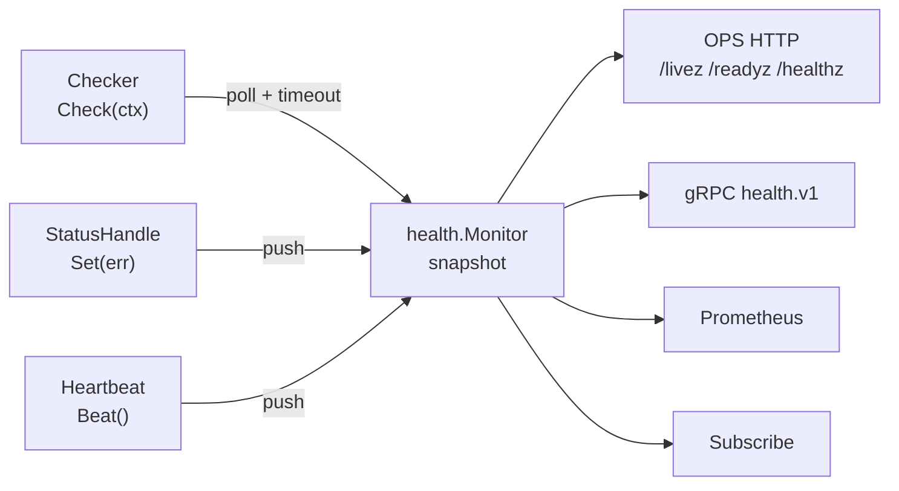

# Health checks

One non-blocking monitor answers three questions for every consumer — Kubernetes, load balancers, gRPC clients, dashboards:

- **Live?** Should the process be restarted?
- **Ready?** Should it receive traffic?
- **Healthy?** Is anything degraded that a human should look at?

- [How it works](#how-it-works)
- [Impact: readiness, liveness, informational](#impact)
- [Three kinds of checks](#three-kinds-of-checks)
- [Writing good checks](#writing-good-checks)
- [HTTP endpoints](#http-endpoints)
- [gRPC health](#grpc-health)
- [Metrics and alerts](#metrics-and-alerts)
- [Monitor behavior in detail](#monitor-behavior-in-detail)

## How it works



Checks run in the monitor's own goroutines. Endpoints only read an immutable snapshot, so **`/readyz` answers in microseconds even when a dependency hangs** — probes never time out because of a slow database.

## Impact

Every check has exactly one impact. Choosing it is the most important decision:

| Impact | When it fails | Use for |
|---|---|---|
| `Readiness` *(default)* | `/readyz` → 503, instance leaves load balancing | Dependencies without which requests cannot be served |
| `Informational` | `/healthz` reports `degraded`, still 200 | Optional dependencies, caches, async pipelines |
| `Liveness` | `/livez` → 503, **the process is restarted** | Internal state only: stuck loops, deadlocks |

> ⚠️ **Never put an external dependency into liveness.** A database outage would restart every replica at once, turning a partial outage into a total one — and restarting does not fix the database.

Also remember: a shared dependency with `Readiness` impact (the main database) going down takes **all** replicas out of rotation. That is usually right — they cannot serve anyway, and clients get a fast 503 from the load balancer instead of timeouts. If the service can do useful work without it, use `Informational`.

## Three kinds of checks

### Poll — the monitor calls you

```go
hc.Register("postgres", health.CheckerFunc(func(ctx context.Context) error {
	if err := pool.Ping(ctx); err != nil {
		return health.PublicError("database unavailable", err)
	}
	return nil
}), health.WithThresholds(2, 1))
```

In a component, register through the environment: `env.Health.Register("postgres", health.CheckerFunc(pool.Ping), health.WithThresholds(2, 1))`.

Most clients already have a `func(ctx) error` ping, so no adapter packages are needed:

```go
env.Health.Register("postgres", health.CheckerFunc(pool.Ping))       // pgx
env.Health.Register("mysql", health.CheckerFunc(db.PingContext))    // database/sql
env.Health.Register("redis", health.CheckerFunc(func(ctx context.Context) error {
	return rdb.Ping(ctx).Err()
}), health.WithImpact(health.Informational))
```

### Push — you report state

For clients that already notify you about connection state (Kafka, NATS, AMQP) — no polling at all:

```go
kafka, _ := hc.Status("kafka", health.WithImpact(health.Informational), health.WithTTL(time.Minute))
client.OnConnect(func() { kafka.Set(nil) })
client.OnDisconnect(func(err error) { kafka.Set(err) })
```

Without `WithTTL`, the last value is valid forever; with it, a status not refreshed in time becomes `stale`.

### Heartbeat — prove a loop is alive

```go
hb, _ := hc.Heartbeat("consumer-loop", 30*time.Second) // Liveness impact

tick := time.NewTicker(10 * time.Second) // wake up even when idle
defer tick.Stop()
for {
	hb.Beat()
	select {
	case <-ctx.Done():
		return nil
	case msg := <-messages:
		handle(msg)
	case <-tick.C:
	}
}
```

If `Beat()` is not called for 30s, `/livez` fails and the process gets restarted.

For periodic work, [`service.NewTicker`](lifecycle.md#periodic-tasks) does the loop for you — beat at the end of a successful run and pick a `maxAge` of a few intervals.

### Registering from services

Any service added with `app.Add` (or passed to `service.Run` together with `service.WithHealth`) that implements `Check(ctx) error` is registered automatically under its `Name()` as a readiness check. Implement `HealthOptions() []health.Option` to change the defaults:

```go
func (c *Cache) HealthOptions() []health.Option {
	return []health.Option{health.WithImpact(health.Informational)}
}
```

For a launcher, pass the check and its options together: `service.WithLauncherHealthCheck(client.Ping, health.WithImpact(health.Informational))`.

Duplicate names and invalid registrations make `Run` fail **before** any service starts.

## Writing good checks

✅ Do:

- respect `ctx` and return promptly when it is canceled;
- keep it cheap — a `Ping`, a `SELECT 1`, not a business query;
- set timeouts in the client itself; the monitor's `timeout` is a safety net;
- wrap errors in `health.PublicError("safe message", err)` if you want text in HTTP responses;
- call `hc.Trigger("postgres")` from reconnect callbacks to re-check immediately.

❌ Don't:

- check other services transitively (service A's readiness depending on service B's `/readyz` cascades outages);
- leave goroutines running after `Check` returns;
- use liveness for anything outside the process.

## HTTP endpoints

Semantics follow the Kubernetes API server.

| Endpoint | For | 200 | 503 |
|---|---|---|---|
| `GET /livez` | `livenessProbe` | live | a liveness check fails, monitor stopped |
| `GET /readyz` | `readinessProbe`, `startupProbe` | all readiness checks pass | any is unknown / failing / stale, or draining |
| `GET /healthz` | dashboards, on-call | `ok`, `degraded` | `failing` |
| `GET /livez/<check>`, `/readyz/<check>` | manual debugging | the check passes | otherwise, or the monitor is stopped, or (`/readyz/<check>` only) draining; 404 for unknown names |

```console
$ curl -s 'localhost:8090/readyz?verbose'
[+]postgres ok
[-]redis failed: timeout
readyz check failed
```

```console
$ curl -s localhost:8090/healthz | jq
{
  "status": "degraded",
  "live": true,
  "ready": true,
  "draining": false,
  "checks": {
    "postgres": { "impact": "readiness", "status": "passing", "checked_at": "2026-09-27T10:00:00Z", "duration_ms": 1, "last_success": "2026-09-27T10:00:00Z" },
    "kafka":    { "impact": "informational", "status": "failing", "checked_at": "2026-09-27T10:00:00Z", "duration_ms": 0, "error": "error", "consecutive_failures": 3 }
  }
}
```

Query parameters:

- `?verbose` — per-check lines;
- `?exclude=<name>` (repeatable) — ignore a check for an emergency bypass; never overrides draining;
- `?format=json` — JSON for `/livez` and `/readyz` (`/healthz` is always JSON).

Security: error texts are never exposed, only a classification (`timeout`, `panic`, `stale`, `canceled`, `error`) or your `health.PublicError` message. Full errors go to logs, with secret masking applied. `/healthz` still reveals the list of dependencies — keep the ops port private.

Without any checks registered, `/livez` and `/readyz` return 200 while the process is up, so every service gets working probes out of the box.

## gRPC health

`grpc.WithHealth(hc)` registers the standard `grpc.health.v1` service:

| Service name | Follows |
|---|---|
| `""` | ready |
| `readiness` | ready |
| `liveness` | live |
| every registered gRPC service | ready |

Bind a service to specific checks:

```go
grpc.WithHealthService("orders.v1.Orders", "postgres", "kafka")
```

`Watch` clients get updates immediately. When draining starts every service becomes `NOT_SERVING`.

`grpc.WithHealth` owns `grpc.health.v1`. If you also register a health server yourself via `RegisterServices`, `grpc.NewServer` returns `grpc.ErrGRPCHealthRegistered` — use one or the other.

## Metrics and alerts

Served on the ops `/metrics` when `ops.metrics_enabled` is on. The monitor is gathered from a registry owned by that OPS server, next to the process-wide one: every OPS server exports its own monitor, and nothing is registered globally. If one of your collectors uses a `go_bones_health_*` name, the scrape fails with an error naming the metric instead of silently dropping one of them.

| Metric | Type | Labels |
|---|---|---|
| `go_bones_health_live`, `_ready`, `_draining` | gauge 0/1 | — |
| `go_bones_health_check_up` | gauge | `check`, `impact` |
| `go_bones_health_check_stale` | gauge | `check` |
| `go_bones_health_check_duration_seconds` | histogram | `check` |
| `go_bones_health_check_runs_total` | counter | `check`, `result` |
| `go_bones_health_check_transitions_total` | counter | `check`, `to` |
| `go_bones_health_check_last_success_timestamp_seconds` | gauge | `check` |
| `go_bones_health_check_skipped_total` | counter | `check`, `reason` |
| `go_bones_health_events_dropped_total` | counter | — |

Copy-paste alerts:

```yaml
groups:
  - name: go-bones-health
    rules:
      - alert: ServiceNotReady
        expr: go_bones_health_ready == 0 and go_bones_health_draining == 0
        for: 5m
      - alert: HealthCheckDown
        expr: go_bones_health_check_up{impact="readiness"} == 0
        for: 10m
      - alert: HealthCheckFlapping
        expr: increase(go_bones_health_check_transitions_total[15m]) > 6
```

Logging: only transitions are logged (`→ failing` at warn, error for liveness; `→ passing` at info with `downtime`). A still-failing check is reminded every `health.log_repeat_interval`.

## Monitor behavior in detail

- First run right after start, then every `initial_interval` until the first success, then every `interval` ±10% jitter.
- Services start in parallel with the monitor, so first runs often fail. With `start_period` set, a failure before the first success keeps a polled check `unknown` (readiness stays off, nothing is logged) until the period ends; after that the next failure is logged as usual. Push statuses (`hc.Status`) are not held: nothing runs them again after the period.
- A run exceeding `timeout` is recorded as `timeout` immediately. At most one call per check is in flight; ticks during a hung call are skipped (and counted in `skipped_total`).
- Errors, timeouts and panics are failures; `failure_threshold` / `success_threshold` prevent flapping.
- A result older than `stale_after` (or `WithTTL` for push statuses) is `stale` and counts as failing. A global `stale_after` is raised per check to at least interval + jitter + timeout.
- `hc.Trigger(name)` runs a check out of schedule; calls are coalesced and rate-limited by `min_interval`.
- `hc.Subscribe(func(health.Event))` notifies about transitions. Always re-read `hc.Snapshot()` in the callback — a slow subscriber may miss intermediate events.

All defaults: [Configuration › health](configuration.md#health).
