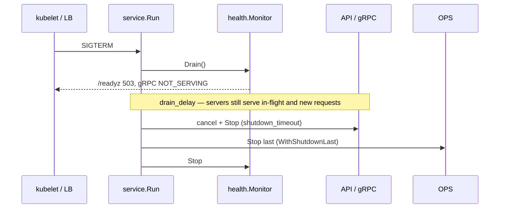

# Lifecycle

`service.Run` starts your components, waits for a signal or a failure, and stops everything in the right order.

- [The Service interface](#the-service-interface)
- [Workers](#workers)
- [Periodic tasks](#periodic-tasks)
- [Grouping services](#grouping-services)
- [Errors and exit codes](#errors-and-exit-codes)
- [Shutdown and drain](#shutdown-and-drain)
- [Options reference](#options-reference)

## The Service interface

Anything long-lived is a `service.Service`:

```go
type Service interface {
	Name() string
	Start(ctx context.Context) error // blocks until the service stops
	Stop(ctx context.Context)        // ctx carries the shutdown deadline
}
```

Optional interfaces a service may implement:

| Interface | Effect |
|---|---|
| `Enabled() bool` | `false` → the service is skipped (e.g. OPS with `enabled: false`) |
| `Check(ctx) error` | Registered as a readiness check under `Name()` when `service.WithHealth` is used |
| `HealthOptions() []health.Option` | Customizes that check (impact, interval, …) |

A launcher gets a check with `service.WithLauncherHealthCheck(fn, opts...)`, e.g. `health.WithImpact(health.Informational)`.

HTTP, gRPC, ops and telemetry services returned by go-bones already implement what they need. For your own code you rarely implement the interface directly — use a launcher.

## Workers

`service.NewLauncher` turns a function into a service. The function must return when `ctx` is canceled:

```go
consumer := service.NewLauncher("consumer", func(ctx context.Context) error {
	for {
		msg, err := reader.FetchMessage(ctx)
		if err != nil {
			if ctx.Err() != nil {
				return nil // normal shutdown
			}
			return fmt.Errorf("fetch: %w", err) // stops the app
		}
		handle(ctx, msg)
	}
},
	service.WithLauncherShutdownHooks(func(context.Context) { _ = reader.Close() }),
	service.WithLauncherHealthCheck(func(ctx context.Context) error { return reader.Ping(ctx) }),
)
```

With the facade, return it from a component constructor and `app.Add(cfg.Consumer, consumer.New)`; the reader comes from `service.Get`, the health monitor from `env.Health`.

How a launcher behaves:

- the callback runs once; a panic is recovered and returned as `service.ErrLauncherPanicked`;
- shutdown hooks run once, from `Start`, right after the callback returns — never concurrently with it;
- hooks get a context without cancellation and deadline (by then `Start`'s context is usually done), so a hook doing blocking cleanup must bound it itself; `Stop` never waits for hooks beyond its own context.

**Protect worker loops with a heartbeat** — a liveness check that fails if the loop gets stuck (deadlock, blocked channel):

```go
hb, _ := hc.Heartbeat("consumer-loop", 30*time.Second)
// call hb.Beat() on every iteration and at least every 10s when idle
```

## Periodic tasks

```go
cleanup := service.NewTicker("cleanup", time.Minute, repo.DeleteExpired,
	service.WithTickerTimeout(10*time.Second), // deadline of one run
	service.WithTickerJitter(0.1),             // ±10%, avoids a thundering herd across replicas
)
```

- The task runs right after start, then every interval; runs never overlap — the next interval starts when a run returns.
- An error is logged (`[cleanup] periodic task failed`) and the ticker keeps going. If a failure should stop the application, write a launcher with `service.NewLauncher` instead.
- A panic stops the service like in any launcher.
- For a liveness signal, call a heartbeat from the task:

```go
hb, err := env.Health.Heartbeat("cleanup", 3*time.Minute)
// ...
service.NewTicker("cleanup", time.Minute, func(ctx context.Context) error {
	hb.Beat()
	return repo.DeleteExpired(ctx)
})
```

## Grouping services

`service.Compose(a, b, c)` bundles services so they can be passed around as one (e.g. from a constructor in another package). Grouped services are started and stopped together with the rest; disabled ones are skipped, and `Check` implementers inside a group are still registered as health checks.

```go
func NewTransport(cfg Config, log *logger.Logger) (service.Service, error) {
	// ...
	return service.Compose(api, rpc), nil
}
```

## Errors and exit codes

- The first service that returns a non-nil error from `Start` triggers shutdown of everything else. `Run` returns `errors.Join` of the errors of **every** failed service, plus the parent context's cause if it is not ignored — compare with `errors.Is`, not `==`.
- `context.Canceled` after a signal is a clean shutdown. A parent context that is already canceled makes `Run` start services with a canceled context, so they exit immediately.
- A service whose `Start` returns `nil` also stops the application: a clean exit of one component is a reason to shut the rest down.
- Expected errors can be ignored: `service.WithIgnoreError(http.ErrServerClosed)`.
- Every service logs `starting service` and, when it returns without a failure, `service stopped` with its `uptime`.
- `app.Run()` returns on a clean shutdown and exits with code `1` on failure; a failed `app.Add` exits with `1` before anything starts. `service.Run` returns the error and leaves exiting to you.

## Shutdown and drain

Without health, shutdown is simple: cancel → `Stop` every service within `shutdown_timeout`.

With `service.WithHealth` and `service.WithDrainDelay` (the facade enables both) shutdown is **phased**, so the load balancer stops sending traffic *before* the servers stop accepting it:



| Phase | Duration | What happens |
|---|---|---|
| Drain | `health.drain_delay` | Readiness is off, traffic still served while endpoints propagate |
| Stop | up to `shutdown_timeout` | Servers stop accepting, finish in-flight requests |
| Stop last | — | OPS server and monitor stop; probes answered 503, not "connection refused" |

Details:

- the drain delay applies only to SIGINT/SIGTERM, not when a service fails;
- a second signal skips the remaining delay;
- total budget is `drain_delay + shutdown_timeout` — your orchestrator's grace period must be larger ([Kubernetes](kubernetes.md#grace-period));
- do **not** combine `drain_delay` with a Kubernetes `preStop: sleep` — the delays add up.

## Options reference

| Option | Purpose |
|---|---|
| `WithService(s...)` | Services to run |
| `WithShutdownTimeout(d)` | Overall stop budget for `Stop` calls (default 15s; each server also has its own `shutdown_timeout`, 30s by default) |
| `WithHealth(hc)` | Start the monitor, auto-register `Check` implementers |
| `WithDrainDelay(d)` | Pause between readiness off and stop |
| `WithShutdownLast(s...)` | Stop these after everything else (usually OPS) |
| `WithIgnoreError(err)` | Treat an error as clean shutdown |
| `WithLoggerPingPong(d)` | Log a heartbeat line every `d` (debugging hung processes) |
| `RunContext(ctx, log, ...)` | Like `Run`, but also stops when `ctx` is canceled — handy in tests |
